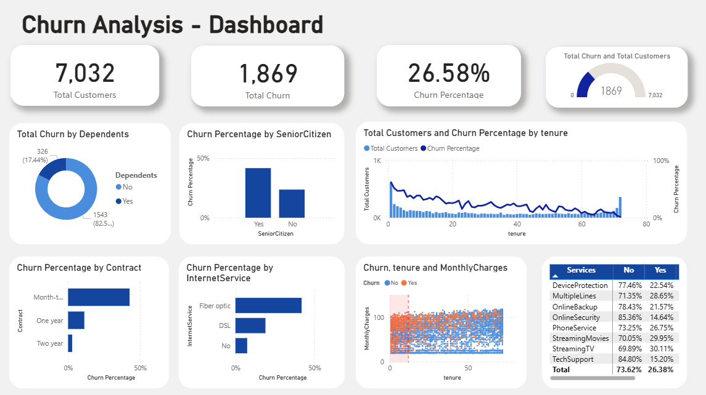

# Telco Customer Churn Prediction

Built an end-to-end churn prediction system using the **Data Science process**:  
define problem → data collection → cleaning → EDA → feature engineering → model tuning → threshold calibration → model evaluation → deployment.

**Model:** XGBoost (threshold = 0.4, optimized for recall)  
**Metrics:** Precision 0.50 • Recall 0.86 • F1 0.63 • ROC-AUC 0.84  
**Deployment:** Streamlit app + Power BI business dashboard

## 🚀 Quickstart (Local)

```bash
# 1) create env (optional)
python -m venv .venv
# Windows
.venv\Scripts\activate
# macOS/Linux
source .venv/bin/activate

# 2) install deps
pip install -r requirements.txt

# 3) run app
streamlit run app/streamlit_app.py

```
Artifacts are already included in artifacts/.
If you retrain, re-export the three files again:

- final_xgb_model.joblib

- final_threshold.npy

- train_columns.json (must match the training feature order)

## 🌐 Deploy
**Option A — Streamlit Community Cloud** 

1. Push this repo to GitHub (public).

2. Go to share.streamlit.io → “New app” → select your repo.

3. Set Main file path: app/streamlit_app.py.

4. Add requirements.txt.

**Option B — Hugging Face Spaces**

1. Create a new Space → Streamlit template.

2. Upload repo (or connect Git).

3. Set app/streamlit_app.py as the entry point.

## 📊 Model & Business Summary

- **Goal:** Predict customers most likely to churn to support proactive retention campaigns and reduce revenue loss.

- **Model:** XGBoost optimized via RandomizedSearchCV and Stratified K-Fold cross-validation.

- **Decision Threshold (0.4):** Calibrated to **maximize recall**, enabling the business to capture more potential churners, even at the cost of precision — aligning with retention-focused objectives.

### 🔍 Key Churn Drivers (Business Insights)
- **Contract Type:** Month-to-month customers are more likely to churn compared to long-term contracts.  
- **Tenure:** Newer customers (<12 months) have higher churn probability.  
- **Monthly Charges:** Higher billing correlates with increased churn risk.  
- **Internet Service:** Fiber optic users show elevated churn due to pricing and service perception.  
- **Tech Support:** Customers without active tech support tend to churn more frequently.

### 💡 Recommended Business Actions
- Introduce **lock-in promotions** for month-to-month / low-tenure customers.  
- **Enhance satisfaction programs** for high-paying fiber-optic customers.  
- Promote **value-added services** (e.g., Tech Support, Online Security) to improve retention.  
- Use churn prediction output to **prioritize retention outreach** and **target high-risk segments** first.

---

🧠 *Business Impact:*  
Helps marketing teams optimize retention campaigns, reduce churn-related revenue loss, and improve lifetime value (LTV) of customers.


## 🧪 Reproducibility

**Open the notebook:**
```
src/TelcoChurnPrediction.ipynb
```
**What it contains:**

- Data cleaning & encoding

- Train/test split (stratified)

- Models compared: Logistic Regression, Random Forest, XGBoost

- Hyperparameter tuning (RandomizedSearchCV)

- Threshold sweep (0.3–0.7) and selection (0.4)

- Model Evaluation (cross validation)

- Export artifacts:
    ```py
    import os, json, joblib, numpy as np
    os.makedirs("../artifacts", exist_ok=True)

    joblib.dump(final_xgb, "../artifacts/final_xgb_model.joblib")
    np.save("../artifacts/final_threshold.npy", np.array([0.4]))
    json.dump(X_train.columns.tolist(), open("../artifacts/train_columns.json","w"))
    ```
## 📊 Power BI Dashboard for Insight before ML modeling

<p align="center">
  
</p>